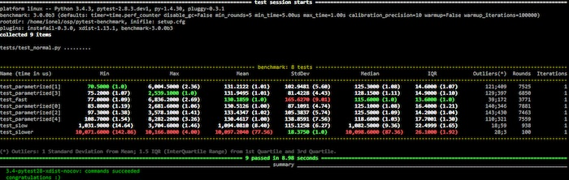
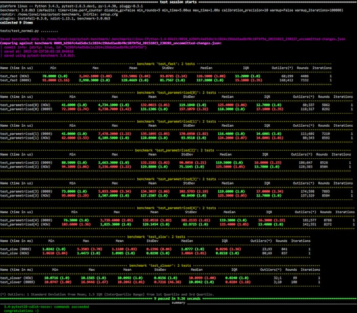

================
Pytest Benchmark
================

Benchmark pozwala w bardzo prosty sposób testować wydajność naszego kodu poprzez wykorzystanie fixture w teście.
Fixture ``benchmark`` jest obiektem wywoływalnym który będzie robił testy wydajnościowe dla każdej przekazanej mu funkcji.

Co zapewnia `pytest-benchmark`?

* rozsądne wartości domyślne i automatyczna kalibracja dla mikro testów wydajnościowych
* dobra integracja z pytest
* porównywanie i śledzenie regresji
* wymuszone statystyki
* eksport danych do JSON

Instalacja
----------

.. code-block:: bash

    $ pip install pytest-benchmark

Wykorzystanie
-------------

.. code-block:: python

    def something(duration=0.000001):
        """
        Function that needs some serious benchmarking.
        """
        time.sleep(duration)
        # You may return anything you want, like the result of a computation
        return 123

    def test_my_stuff(benchmark):
        # benchmark something
        result = benchmark(something)

        # Extra code, to verify that the run completed correctly.
        # Sometimes you may want to check the result, fast functions
        # are no good if they return incorrect results :-)
        assert result == 123

Można również dodawać argumenty

.. code-block:: python

    def test_my_stuff(benchmark):
        benchmark(time.sleep, 0.02)

lub argumenty słów kluczowych

.. code-block:: python

    def test_my_stuff(benchmark):
        benchmark(time.sleep, duration=0.02)

Jeśli potrzebujemy dokładnej kontrolia nad przebiegiem testu (np. funkcja konfiguracji czy dokładna kontrola iteracji i przebiegu)
istnieje specjalny tryb `pedantyczny` pozwalający na dokładne określenie parametrów uruchamianego testu.

.. code-block:: python

    def test_with_setup(benchmark):
        benchmark.pedantic(something, setup=my_special_setup, args=(1, 2, 3), kwargs={'foo': 'bar'}, iterations=10, rounds=100)

Dodatkowe opcje podczas uruchamiania
------------------------------------

Benchmark zawiera szerek dodatkowych opcji ustawianych podczas uruchamiania testu. Więcej
na ich temat możemy znaleźć w dokumentacji modułu http://pytest-benchmark.readthedocs.io/en/stable/usage.html#commandline-options.

Marker
------

Pozwala nam ustawić opcje testowania dla testu porównawczego.

.. code-block:: python

    @pytest.mark.benchmark(
        group="group-name",
        min_time=0.1,
        max_time=0.5,
        min_rounds=5,
        timer=time.time,
        disable_gc=True,
        warmup=False
    )
    def test_my_stuff(benchmark):
        @benchmark
        def result():
            # Code to be measured
            return time.sleep(0.000001)

        # Extra code, to verify that the run
        # completed correctly.
        # Note: this code is not measured.
        assert result is None

Dodatkowe informacje
--------------------

Tworząc zapis wyników do JSON możemy dodać dodatkowe informacje do słownika.

.. code-block:: python

    def test_my_stuff(benchmark):
        benchmark.extra_info['foo'] = 'bar'
        benchmark(time.sleep, 0.02)

Narzędzie Patch
---------------

Jeśli potrzebujesz przetestować wewnętrzną funkcję klasy należy wykorzystać ``benchmark_weave``.

.. code-block:: python

    class Foo(object):
        def __init__(self, arg=0.01):
            self.arg = arg

        def run(self):
            self.internal(self.arg)

        def internal(self, duration):
            time.sleep(duration)

W przypadku testu porównawczego jest to dość trudne do sprawdzenia, jeśli nie ma pełnej
kontroli kodu klasy Foo lub ma on bardzo skomplikowaną konstrukcję. Aby przetestować taką
metodę można wykorzystać eksperymentalne fixture ``benchmark_weave``. Należy jednak
się upewnić że mamy zainstalowany moduł ``aspectlib`` (``pip install aspectlib``
lub ``pip install pytest-benchmark[aspect]``)

.. code-block:: python

    def test_foo(benchmark):
        benchmark.weave(Foo.internal, lazy=True):
        f = Foo()
        f.run()

Zrzuty ekranu
-------------

